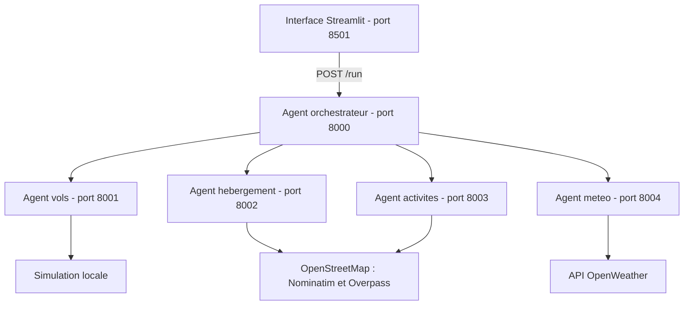

# VoyagePlus

**Un seul espace pour preparer son voyage : vols, hebergements, activites et meteo.**

VoyagePlus regroupe les informations utiles a la preparation d'un sejour dans une
seule interface : vols, hebergements, activites touristiques et meteo. A partir
d'une ville de depart, d'une destination, de dates et d'un budget, un orchestrateur
coordonne quatre agents specialises et rassemble leurs resultats.

Developpe dans le cadre d'un Projet de Fin d'Etudes, VoyagePlus associe une
interface interactive, des services independants et plusieurs sources de donnees.
Il illustre un parcours complet, de la saisie du voyage a la presentation de
resultats structures pour accompagner les choix de l'utilisateur.

## Pourquoi VoyagePlus ?

Organiser un voyage implique souvent de consulter plusieurs plateformes pour
comparer les transports, rechercher un logement, choisir des visites et verifier
la meteo. Cette dispersion rend la preparation longue et complique la lecture
globale du sejour.

VoyagePlus vise a simplifier ce parcours pour les etudiants, les voyageurs
occasionnels et les personnes preparant un court sejour. Le projet poursuit
quatre objectifs :

- Centraliser les informations essentielles dans une interface unique.
- Automatiser la collecte et le traitement des donnees par des agents specialises.
- Selectionner et classer les resultats pour faciliter leur comparaison.
- Proposer une vue d'ensemble du sejour pour accompagner la decision.

## Points forts

- **Une recherche centralisee** : une seule saisie pour retrouver les quatre
  categories d'informations utiles au sejour.
- **Une architecture modulaire** : chaque agent prend en charge un domaine
  precis, ce qui facilite l'evolution des fonctionnalites et des sources de donnees.
- **Des traitements concurrents** : l'orchestrateur lance les recherches des
  agents en parallele et rassemble leurs reponses.
- **Des recommandations classees** : les hebergements et les activites sont
  selectionnes a partir de criteres de prix, de distance ou d'interet.
- **Une restitution lisible** : Streamlit presente les resultats par categorie
  pour faciliter la consultation et la comparaison.
- **Une base testable** : les services disposent d'une documentation API
  interactive et de tests automatises executes avec GitHub Actions.

## Fonctionnalites

| Fonctionnalite | Ce que propose VoyagePlus |
| --- | --- |
| Saisie du voyage | Ville de depart, destination, dates et budget dans Streamlit |
| Vols aller-retour | Generation locale de vols de demonstration pour Paris/Rome, Paris/Rabat et Paris/Madrid, dans les deux sens |
| Hebergements | Recherche de lieux dans OpenStreetMap, estimation des prix et classement selon la distance et le prix |
| Activites | Selection de cinq lieux au maximum, classes selon leur interet et leur distance au centre de la destination |
| Meteo | Temperature, humidite, conditions actuelles et conseil adapte a la temperature via OpenWeather |
| Orchestration | Appels concurrents aux quatre agents et regroupement des reponses |
| Restitution | Affichage des resultats par categorie dans une seule interface |

## Architecture

L'interface transmet une requete JSON a l'orchestrateur. Celui-ci distribue les
taches aux agents via HTTP, attend leurs reponses avec `asyncio.gather`, puis
retourne les resultats agreges a Streamlit.



Chaque service FastAPI expose `POST /run` et une documentation interactive sur
`/docs`. Lorsqu'un appel a un agent echoue, l'orchestrateur peut conserver les
resultats renvoyes par les autres agents.

### Technologies utilisees

| Technologie | Role |
| --- | --- |
| Python 3.11 | Logique des agents, traitement des donnees et orchestration |
| FastAPI et Uvicorn | Exposition et execution des services HTTP |
| Streamlit | Interface de saisie et presentation des resultats |
| HTTPX et Requests | Appels HTTP entre services, vers les sources externes et depuis l'interface |
| python-dotenv | Chargement de la configuration locale |
| OpenStreetMap, Nominatim et Overpass | Geocodage et recherche de lieux |
| OpenWeather | Informations meteorologiques actuelles |
| unittest et Streamlit AppTest | Tests des services et de l'interface |
| GitHub Actions | Execution automatique des tests lors des pushes et pull requests |

La communication entre agents repose sur des requetes HTTP et des reponses JSON.
Les composants communs centralisent les appels et la creation des services,
tandis que chaque agent conserve sa propre logique de traitement.

## Installation

Prerequis : Python 3.11 et une connexion Internet pour les services externes.
Depuis la racine du projet, dans PowerShell :

```powershell
python -m venv .venv
.\.venv\Scripts\Activate.ps1
python -m pip install -r requirements.txt
```

Sous Linux ou macOS, activer l'environnement avec `source .venv/bin/activate`.

Si le fichier `.env` n'existe pas encore, creer la configuration locale :

```powershell
Copy-Item .env.example .env
```

Renseigner ensuite `OPENWEATHER_API_KEY` dans `.env`. Cette cle est necessaire
uniquement pour la meteo. Sans cle, les autres agents restent utilisables et la
meteo affiche un message.

Les dependances directes sont epinglees dans `requirements.txt`. Le fichier
`.env`, l'environnement `.venv`, les caches et les journaux sont exclus de Git ;
seul le modele de configuration `.env.example` est versionne.

## Lancement

Ouvrir six terminaux a la racine du projet et activer l'environnement dans chacun.
Executer une commande par terminal :

| Terminal | Commande | Port |
| --- | --- | --- |
| Vols | `python -m agents.flight_agent` | 8001 |
| Hebergements | `python -m agents.stay_agent` | 8002 |
| Activites | `python -m agents.activities_agent` | 8003 |
| Meteo | `python -m agents.weather_agent` | 8004 |
| Orchestrateur | `python -m agents.orchestrateur_agent` | 8000 |
| Interface | `python -m streamlit run travel_ui.py` | 8501 |

Les ports 8000 a 8004 et 8501 doivent etre disponibles.

- Interface : http://localhost:8501
- Documentation de l'orchestrateur : http://127.0.0.1:8000/docs

### Erreur Windows : Fatal error in launcher

Cette erreur peut apparaitre apres un deplacement du projet : les lanceurs
`.exe` de l'ancien environnement referencent encore son ancien chemin.
Depuis la racine du projet, utiliser directement le Python de l'environnement :

```powershell
.\.venv\Scripts\python.exe -m uvicorn agents.flight_agent.__main__:app --port 8001
```

Cette commande fonctionne sans activation du terminal et sans passer par
`uvicorn.exe`. Pour un nouveau clone ou une autre machine, creer un nouvel
environnement avec les commandes d'installation au lieu de copier `.venv`.

## Exemple d'utilisation

1. Saisir une ville de depart et une destination, par exemple Paris et Rome.
2. Choisir des dates de depart et de retour coherentes, puis indiquer un budget.
3. Lancer la planification.
4. Consulter les vols aller-retour, les hebergements, les activites et la meteo.

Exemple de corps JSON pour `POST http://127.0.0.1:8000/run` :

```json
{
  "origin": "Paris",
  "destination": "Rome",
  "start_date": "2027-05-10",
  "end_date": "2027-05-13",
  "budget": 1500
}
```

La reponse regroupe les cles `flights`, `stay`, `activities` et `weather`,
directement exploitees par l'interface pour afficher les differentes propositions.

## Structure du depot

```text
agents/
  activities_agent/     Recherche et classement des lieux touristiques
  flight_agent/         Generation des vols de demonstration
  orchestrateur_agent/  Coordination des appels et agregation des resultats
  stay_agent/           Recherche d'hebergements et estimation des prix
  weather_agent/        Meteo actuelle de la destination
common/
  a2a_client.py         Client HTTP pour appeler les agents
  a2a_server.py         Creation des applications FastAPI
image/                  Image utilisee par l'interface
tests/                  Tests des services et de l'interface
.github/workflows/      Verification automatique sur GitHub
.env.example            Modele de configuration sans secret
requirements.txt        Dependances Python
travel_ui.py            Interface Streamlit
```

Les modules `__main__.py` demarrent les services. Les `task_manager.py` relient
leurs routes a la logique metier ; celui de l'orchestrateur coordonne les appels
aux quatre agents.

## Tests et evaluation

### Tests automatises du depot

```powershell
python -m unittest discover -s tests -v
```

Les six tests couvrent l'exposition des services, la generation d'un aller-retour,
l'agregation des reponses, une panne partielle et les messages d'erreur dans
l'interface. Ils utilisent des reponses simulees pour les appels externes et
n'exigent pas de cle API. Le workflow GitHub Actions execute cette meme suite.

Ces tests ne verifient pas la disponibilite reelle d'OpenWeather, de Nominatim
ou d'Overpass, ni les performances en production.

### Evaluation du parcours utilisateur

Le memoire rapporte une evaluation qualitative du prototype a partir de
scenarios d'usage et d'une grille d'utilisabilite. Elle porte sur la clarte de
l'interface, la navigation, la comprehension des fonctionnalites, la pertinence
des recommandations et la coherence du parcours.

Cette analyse experte, realisee sans utilisateurs finaux, apporte un premier
regard sur le parcours et les pistes d'amelioration de l'interface.

## Perimetre du prototype

VoyagePlus est un demonstrateur d'aide a la decision, sans reservation ni paiement.
Il combine des donnees externes et des donnees de demonstration :

- Les vols sont simules et les tarifs des hebergements sont estimes.
- Les lieux proviennent d'OpenStreetMap ; la meteo correspond aux conditions
  actuelles fournies par OpenWeather, et non aux dates du sejour.
- Le budget est utilise comme plafond par nuit pour l'hebergement ; sa repartition
  entre les differentes composantes du voyage reste une perspective d'evolution.
- Les activites sont recherchees dans un rayon fixe de 7 km, pour la categorie `top`.

La demonstration s'execute localement et depend de la disponibilite des API
externes. Utiliser des dates coherentes : l'agent vols decale le retour de trois
jours si sa date precede ou egale celle du depart. La version actuelle fonctionne
sans comptes utilisateurs ni historique persistant.

## Perspectives d'evolution

- Mener des tests avec des utilisateurs reels.
- Ameliorer la lisibilite et la hierarchisation des recommandations.
- Enrichir la personnalisation et les sources de donnees.
- Optimiser les echanges entre agents et les temps de reponse.
- Renforcer la validation des dates et la repartition du budget.
- Etudier la gestion des profils utilisateurs et le passage a plus grande echelle.

## Cadre academique et auteurs

VoyagePlus a ete realise en binome dans le cadre d'un Projet de Fin d'Etudes,
selon une demarche progressive de conception, de developpement et d'evaluation.

| Element | Information |
| --- | --- |
| Formation | Master 2 - Technologie de l'Information, Produits et Services Multimedia |
| Annee universitaire | 2025-2026 |
| Auteurs | Wissam AMEKRANE et Safae CHOUAI |
| Encadrement pedagogique | M. Marc Bertin |
| Encadrement de la conception et de la gestion de projet | M. Federico Tajariol |

## Licence

Aucune licence de redistribution n'est actuellement declaree dans ce depot.
