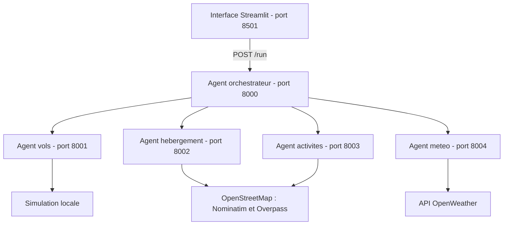

# VoyagePlus

**Planification de voyages et aide a la decision par une architecture multi-agents.**

VoyagePlus regroupe les informations utiles a la preparation d'un sejour dans une
seule interface : vols, hebergements, activites touristiques et meteo. A partir
d'une ville de depart, d'une destination, de dates et d'un budget, un orchestrateur
coordonne quatre agents specialises et rassemble leurs resultats.

Ce depot contient le prototype academique du projet. Les vols sont simules et
les prix des hebergements sont estimes ; le service ne permet pas de reserver
ni de payer un voyage.

## Cadre academique

| Element | Information |
| --- | --- |
| Formation | Master 2 - Technologie de l'Information, Produits et Services Multimedia |
| Projet | Memoire de Projet de Fin d'Etudes - VoyagePlus |
| Annee universitaire | 2025-2026 |
| Realisation | Wissam AMEKRANE et Safae CHOUAI |
| Encadrement pedagogique | M. Marc Bertin |
| Encadrement de la conception et de la gestion de projet | M. Federico Tajariol |

La presentation du projet s'appuie sur le memoire VoyagePlus, notamment les
chapitres consacres a la problematique, a la conception, au developpement et a
l'evaluation. Les instructions techniques ci-dessous decrivent le code disponible
dans ce depot.

## Problematique et objectifs

Organiser un voyage implique souvent de consulter plusieurs plateformes pour
comparer les transports, rechercher un logement, choisir des visites et verifier
la meteo. Cette dispersion rend la preparation longue et complique la lecture
globale du sejour.

VoyagePlus vise a simplifier ce parcours pour les etudiants, les voyageurs
occasionnels et les personnes preparant un court sejour. Le projet poursuit
quatre objectifs :

- Centraliser les informations essentielles dans une interface unique.
- Automatiser la collecte et le traitement des donnees par des agents specialises.
- Selectionner et classer les resultats pour faciliter leur comparaison.
- Proposer une vue d'ensemble du sejour pour accompagner la decision.

L'approche repose sur la separation des responsabilites, le filtrage et le calcul
de scores. La version actuelle n'utilise pas de modele d'apprentissage automatique
pour personnaliser les recommandations.

## Fonctionnalites du prototype

| Fonctionnalite | Comportement dans cette version |
| --- | --- |
| Saisie du voyage | Ville de depart, destination, dates et budget dans Streamlit |
| Vols aller-retour | Generation locale de vols de demonstration pour Paris/Rome, Paris/Rabat et Paris/Madrid, dans les deux sens |
| Hebergements | Recherche de lieux dans OpenStreetMap, estimation des prix et classement selon la distance et le prix |
| Activites | Selection de cinq lieux au maximum, classes selon leur interet et leur distance au centre de la destination |
| Meteo | Temperature, humidite, conditions actuelles et conseil adapte a la temperature via OpenWeather |
| Orchestration | Appels concurrents aux quatre agents et regroupement des reponses |
| Restitution | Affichage des resultats par categorie dans une seule interface |

## Architecture

L'interface transmet une requete JSON a l'orchestrateur. Celui-ci distribue les
taches aux agents via HTTP, attend leurs reponses avec `asyncio.gather`, puis
retourne les resultats agreges a Streamlit.



Chaque service FastAPI expose `POST /run` et une documentation interactive sur
`/docs`. Lorsqu'un appel a un agent echoue, l'orchestrateur peut conserver les
resultats renvoyes par les autres agents.

### Technologies utilisees

| Technologie | Role |
| --- | --- |
| Python 3.11 | Logique des agents, traitement des donnees et orchestration |
| FastAPI et Uvicorn | Exposition et execution des services HTTP |
| Streamlit | Interface de saisie et presentation des resultats |
| HTTPX et Requests | Appels HTTP entre services, vers les sources externes et depuis l'interface |
| python-dotenv | Chargement de la configuration locale |
| OpenStreetMap, Nominatim et Overpass | Geocodage et recherche de lieux |
| OpenWeather | Informations meteorologiques actuelles |
| unittest et Streamlit AppTest | Tests des services et de l'interface |
| GitHub Actions | Execution automatique des tests lors des pushes et pull requests |

Le memoire decrit ADK et des experimentations avec Hugging Face. Ces integrations
ne sont pas actives dans le code actuel et ne sont pas necessaires a son
installation. Les modules `a2a_client.py` et `a2a_server.py` assurent des echanges
HTTP/JSON entre agents ; ils n'implementent pas le protocole A2A complet.
RapidAPI est mentionne dans le rapport, mais l'agent vols de ce depot utilise
uniquement des donnees simulees.

## Installation

Prerequis : Python 3.11 et une connexion Internet pour les services externes.
Depuis la racine du projet, dans PowerShell :

```powershell
python -m venv .venv
.\.venv\Scripts\Activate.ps1
python -m pip install -r requirements.txt
```

Sous Linux ou macOS, activer l'environnement avec `source .venv/bin/activate`.

Si le fichier `.env` n'existe pas encore, creer la configuration locale :

```powershell
Copy-Item .env.example .env
```

Renseigner ensuite `OPENWEATHER_API_KEY` dans `.env`. Cette cle est necessaire
uniquement pour la meteo. Sans cle, les autres agents restent utilisables et la
meteo affiche un message.

Les dependances directes sont epinglees dans `requirements.txt`. Le fichier
`.env`, l'environnement `.venv`, les caches et les journaux sont exclus de Git ;
seul le modele de configuration `.env.example` est versionne.

## Lancement

Ouvrir six terminaux a la racine du projet et activer l'environnement dans chacun.
Executer une commande par terminal :

| Terminal | Commande | Port |
| --- | --- | --- |
| Vols | `python -m agents.flight_agent` | 8001 |
| Hebergements | `python -m agents.stay_agent` | 8002 |
| Activites | `python -m agents.activities_agent` | 8003 |
| Meteo | `python -m agents.weather_agent` | 8004 |
| Orchestrateur | `python -m agents.orchestrateur_agent` | 8000 |
| Interface | `python -m streamlit run travel_ui.py` | 8501 |

Les ports 8000 a 8004 et 8501 doivent etre disponibles.

- Interface : http://localhost:8501
- Documentation de l'orchestrateur : http://127.0.0.1:8000/docs

### Erreur Windows : Fatal error in launcher

Cette erreur peut apparaitre apres un deplacement du projet : les lanceurs
`.exe` de l'ancien environnement referencent encore son ancien chemin.
Depuis la racine du projet, utiliser directement le Python de l'environnement :

```powershell
.\.venv\Scripts\python.exe -m uvicorn agents.flight_agent.__main__:app --port 8001
```

Cette commande fonctionne sans activation du terminal et sans passer par
`uvicorn.exe`. Pour un nouveau clone ou une autre machine, creer un nouvel
environnement avec les commandes d'installation au lieu de copier `.venv`.

## Exemple d'utilisation

1. Saisir une ville de depart et une destination, par exemple Paris et Rome.
2. Choisir des dates de depart et de retour coherentes, puis indiquer un budget.
3. Lancer la planification.
4. Consulter les vols aller-retour, les hebergements, les activites et la meteo.

Exemple de corps JSON pour `POST http://127.0.0.1:8000/run` :

```json
{
  "origin": "Paris",
  "destination": "Rome",
  "start_date": "2027-05-10",
  "end_date": "2027-05-13",
  "budget": 1500
}
```

La reponse regroupe les cles `flights`, `stay`, `activities` et `weather`.
Le budget saisi n'est pas encore reparti entre le transport, le logement et
les activites : voir les limites ci-dessous.

## Structure du depot

```text
agents/
  activities_agent/     Recherche et classement des lieux touristiques
  flight_agent/         Generation des vols de demonstration
  orchestrateur_agent/  Coordination des appels et agregation des resultats
  stay_agent/           Recherche d'hebergements et estimation des prix
  weather_agent/        Meteo actuelle de la destination
common/
  a2a_client.py         Client HTTP pour appeler les agents
  a2a_server.py         Creation des applications FastAPI
image/                  Image utilisee par l'interface
tests/                  Tests des services et de l'interface
.github/workflows/      Verification automatique sur GitHub
.env.example            Modele de configuration sans secret
requirements.txt        Dependances Python
travel_ui.py            Interface Streamlit
```

Les modules `__main__.py` demarrent les services. Les `task_manager.py` relient
leurs routes a la logique metier ; celui de l'orchestrateur coordonne les appels
aux quatre agents.

## Tests et evaluation

### Tests automatises du depot

```powershell
python -m unittest discover -s tests -v
```

Les six tests couvrent l'exposition des services, la generation d'un aller-retour,
l'agregation des reponses, une panne partielle et les messages d'erreur dans
l'interface. Ils utilisent des reponses simulees pour les appels externes et
n'exigent pas de cle API. Le workflow GitHub Actions execute cette meme suite.

Ces tests ne verifient pas la disponibilite reelle d'OpenWeather, de Nominatim
ou d'Overpass, ni les performances en production.

### Evaluation presentee dans le memoire

Le memoire rapporte une evaluation qualitative du prototype a partir de
scenarios d'usage et d'une grille d'utilisabilite. Elle porte sur la clarte de
l'interface, la navigation, la comprehension des fonctionnalites, la pertinence
des recommandations et la coherence du parcours.

Cette evaluation a ete menee sans utilisateurs finaux. Elle constitue une
premiere analyse du prototype, sans mesure quantitative de satisfaction ou
de performance des utilisateurs.

## Limites et perspectives

### Limites actuelles

- Les vols et leurs prix sont simules ; aucune disponibilite aerienne n'est verifiee.
- Les prix des hebergements sont des estimations locales, sans verification des
  tarifs ni des disponibilites. Le budget total est transmis comme plafond par
  nuit a l'agent hebergement.
- La meteo correspond au moment de la recherche, pas aux dates du sejour.
- Les activites utilisent un rayon fixe de 7 km et la categorie `top`, meme si
  d'autres valeurs sont envoyees a l'orchestrateur.
- Les donnees ouvertes, les quotas et les temps de reponse des API peuvent
  limiter les resultats.
- La validation des entrees reste partielle. Si la date de retour precede ou
  egale le depart, l'agent vols la decale de trois jours.
- Le prototype est destine a une demonstration locale. Il ne comprend ni
  reservation, ni paiement, ni comptes utilisateurs, ni historique persistant.

### Perspectives issues du rapport

- Mener des tests avec des utilisateurs reels.
- Ameliorer la lisibilite et la hierarchisation des recommandations.
- Enrichir la personnalisation et les sources de donnees.
- Optimiser les echanges entre agents et les temps de reponse.
- Etudier la gestion des profils utilisateurs et le passage a plus grande echelle.

La validation des dates et la repartition effective du budget constituent aussi
des ameliorations techniques a apporter a cette version.

## Equipe et contributions

Le projet a ete realise en binome, avec une conception globale, une architecture,
une integration et une documentation menees en collaboration.

| Membre | Contributions principales decrites dans le memoire |
| --- | --- |
| Wissam AMEKRANE | Agents activites et hebergement, integration des fonctionnalites, tests et ajustements techniques |
| Safae CHOUAI | Agents meteo et vols, participation a l'interface Streamlit, integration des fonctionnalites, tests et ajustements techniques |

Le travail a suivi une demarche progressive : conception, developpement des
agents, integration et tests, puis documentation et preparation de la soutenance.

## Licence

Aucune licence de redistribution n'est actuellement declaree dans ce depot.
